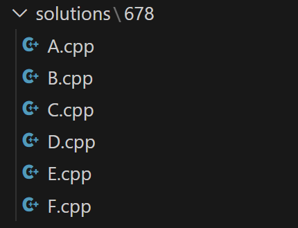

# CF-minihelper

Plugin gives user a possibility to quickly create soultion files (with your own template) to all problems from Codeforces round by its ID.

## Features

After installing you will have 2 commands:

### 1) CF-HELPER: START-CONTEST

Asks user an ID of contest and asks for path to template file (if there is no already existing path). And creates new folder solutions, and cpp files for every task in contest/round (i.e If there are 5 tasks A-E there will be files: A.cpp, B.cpp, etc. already containing specified template)

### 2) CF-HELPER: SET-NEW-TEMPLATE

By this command you can specify (or change already existing) path to template file.

## Example of using

```
> CF-HELPER: START-CONTEST
```

```
Введите ID контеста codeforces:
> 678
```




## Commit History

1) 9e76188 Plugin completed
2) cfa22f4 Package.json updated
3) 18fd427 Merge branch 'master' of https://github.com/dvwinner/cf-helper-plugin


## Credentials
Arsenii Vlasov M3101 ITMO lab.
